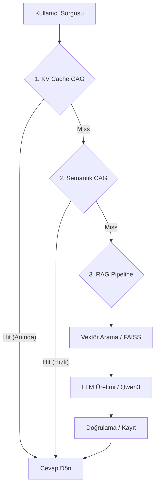

# 🇹🇷 Gelişmiş Hukuk Soru-Cevap Sistemi

**KV Cache + Semantic CAG + RAG Mimarisi** | Qwen3:8B via Ollama | Tamamen Türkçe

Bu sistem, hukuk verilerini üç aşamalı bir boru hattı (pipeline) üzerinden işler. Amaç, en doğru cevabı en hızlı şekilde (milisaniyeler içinde) kullanıcıya sunmaktır.

## Mimari Akış



1.  **KV Cache CAG (Prompt Pre-fill):** İlk 100 soru-cevap ikilisi Ollama'nın VRAM'inde önceden "ısıtılmış" (pre-filled) olarak tutulur. Eğer soru buradaysa cevap **neredeyse 0ms** gecikmeyle döner.
2.  **Semantik CAG (Semantic Cache):** Geçmişte sorulmuş ve doğrulanmış tüm sorular vektör tabanlı olarak taranır. %90+ benzerlik varsa RAG'e gitmeden cevaplanır.
3.  **RAG Pipeline:** Eğer yukarıdaki iki katmanda cevap bulunamazsa, 50.000+ satırlık veri tabanında FAISS ile arama yapılır ve LLM (Qwen3) bağlamı kullanarak cevap üretir.

## Gereksinimler

- Python 3.9+
- [Ollama](https://ollama.ai/) (Arka uç model sunucusu)
- `qwen3:8b` modeli (`ollama pull qwen3:8b`)

## Kurulum ve Çalıştırma

### 1. Dosya Yapısı
`main set.json` dosyasının proje kök dizininde olduğundan emin olun.

### 2. Bağımlılıklar
```bash
pip install -r requirements.txt
```

### 3. Uygulamayı Başlatın
```bash
python app.py
```
Default olarak `http://127.0.0.1:5000` adresinde çalışacaktır.

## Modüller

| Modül | Görev |
|-------|-------|
| `src/kv_cag_pipeline.py` | **[YENİ]** VRAM tabanlı KV Cache yönetimi |
| `src/cag_cache.py` | Semantik önbellek mantığı (CAG) |
| `src/rag_pipeline.py` | Çekme-Artırılmış Üretim (RAG) akışı |
| `src/vector_store.py` | FAISS vektör deposu işlemleri |
| `src/validator.py` | LLM cevaplarının hukuki doğruluğunu kontrol eder |
| `app.py` | Flask API ve Rota yönetimi |

## Gelişmiş Ayarlar (UI)

- **KV Cache CAG:** Bu seçenek aktif edildiğinde model belleğe yüklenir (10-30sn sürer) ve statik QA seti anında sorgulanabilir hale gelir.
- **CAG Geliştirme (Refine):** Önbellekten gelen cevapların LLM tarafından yeniden işlenmesini sağlar (daha kaliteli ama daha yavaş).
- **Semantik Eşik:** Önbellek benzerlik hassasiyetini ayarlar.

---
*Not: Bu sistem tamamen yerel (local) çalışır, verileriniz hiçbir bulut servisine gönderilmez.*
